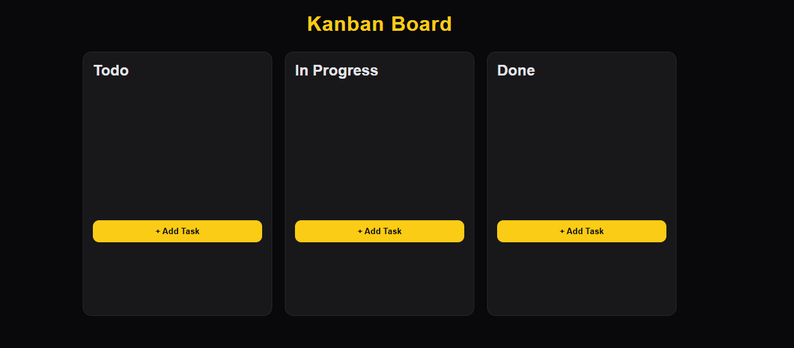
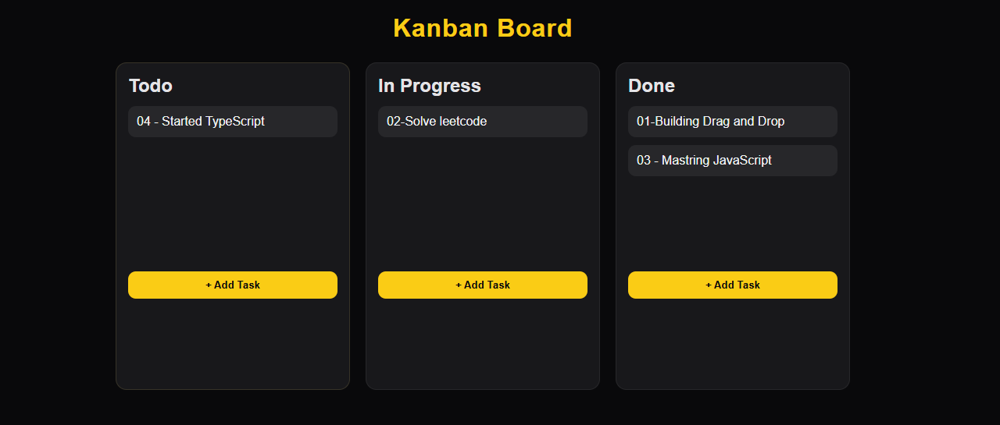

# Kanban Board

A clean and minimal **drag-and-drop Kanban Board** built with pure HTML, CSS, and JavaScript — no frameworks, no dependencies.

---

## 📸 Screenshots

|                 Board View                 |                Drag & Drop                 |
| :----------------------------------------: | :----------------------------------------: |
|  |  |

---

## ✨ Features

- ➕ **Create tasks** — quickly add new cards to any column
- 🗃️ **Multiple columns** — organized into _To Do_, _In Progress_, and _Done_
- 🖱️ **Drag & Drop** — move tasks between columns effortlessly

---

## 🛠️ Tech Stack

| Technology     | Role                                  |
| -------------- | ------------------------------------- |
| **HTML**       | Page structure & layout               |
| **CSS**        | Styling & visual design               |
| **JavaScript** | Drag-and-drop logic & task management |

---

## 📂 Project Structure

```
kanban-board/
│
├── index.html       # Main HTML file
├── style.css        # Styles
└── script.js        # Drag & drop logic + task
```

---

## 🚀 Getting Started

**1. Clone the repository**

```bash
git clone https://github.com/your-username/kanban-board.git
```

**2. Navigate into the project folder**

```bash
cd kanban-board
```

**3. Open in your browser**

```bash
# Simply open index.html directly
open index.html
```

> No installs. No build step. Just open and go. ✅

---

## 📌 How to Use

1. **Add a task** — type in the input field and hit _Add_
2. **Move a task** — drag any card and drop it into another column
3. **Track progress** — use the three columns to manage your workflow

---
